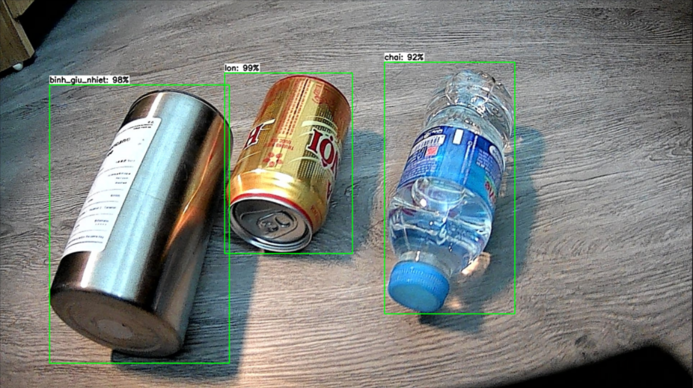
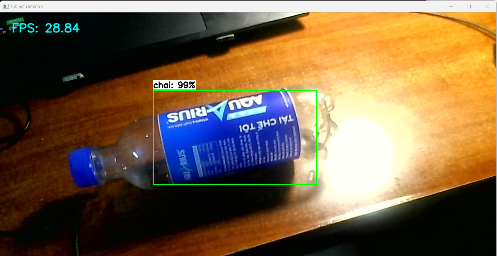

# Bottle, can and thermos flask detector model using SSD-MobileNet

This model was trained using a Colab notebook by EdjeElectronics.
[details here](https://github.com/EdjeElectronics/TensorFlow-Lite-Object-Detection-on-Android-and-Raspberry-Pi/tree/master)

## Deploy and run the model on Raspberry Pi, Windows or MacOS
### Using TensorFlow Lite to deploy the model
[deploy guides](https://github.com/EdjeElectronics/TensorFlow-Lite-Object-Detection-on-Android-and-Raspberry-Pi/tree/master/deploy_guides)

**Known issues:** There are some outdated dependencies for Raspberry Pi, using [this modifiled shell script](https://github.com/bhuuan/ssd-bottle-detection/blob/main/utils/get_pi_requirements.sh) to install TensorFlow Lite and OpenCV to avoid errors.

### Run the model
Follow the above guide to run custom-trained model in *custom_model_lite* folder to detect bottle, can and thermos flask.

